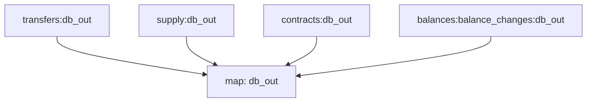

# Substreams: `EVM Tokens`

> ERC-20 Token events

## Setup

### ClickHouse
1. Install [ClickHouse](https://clickhouse.com/docs/en/getting-started/quick-start) locally
2. Start the ClickHouse server: `./clickhouse server`
3. Use the ClickHouse client to create database and apply schema:
```
./clickhouse client --host=127.0.0.1 --port=9000 --database=erc20_tokens_v1 < schema.sql
```
4. Set the `CLICKHOUSE_URL` environment variable:
```
export CLICKHOUSE_URL="clickhouse://default:@127.0.0.1:9000/erc20_tokens_v1"
```

### `substreams-sink-sql`
- Link to repo: https://github.com/streamingfast/substreams-sink-sql
- Link to releases: https://github.com/streamingfast/substreams-sink-sql/releases

Ensure you have `Rust`, `Cargo` and `protobuf` installed:
1. `brew install protobuf`
2. `curl --proto '=https' --tlsv1.2 -sSf https://sh.rustup.rs | sh`
3. Verify installation:
```
protoc --version  # Should return a valid version
rustc --version   # Should return Rust version
cargo --version   # Should return Cargo version
```
4. Clone repo
```
git clone https://github.com/streamingfast/substreams-sink-sql.git
cd substreams-sink-sql
cargo build --release
cp target/release/substreams-sink-sql ~/.cargo/bin/
substreams-sink-sql --help # Should be able to run this from anywhere
```
If this doesn't work and you need to use the pre-built binary instead of building it from source, do the following:
- Download the latest release for your system from https://github.com/streamingfast/substreams-sink-sql/releases
- `tar -xvzf substreams-sink-sql-linux-amd64.tar.gz` # Adjust filename for your OS
- `sudo mv substreams-sink-sql ~/.local/bin`
- `chmod +x ~/.local/bin/substreams-sink-sql`
- `export PATH="$HOME/.local/bin:$PATH"` # If not already on your `PATH`
- Verify the installation with `substreams-sink-sql --help`

### StreamingFast Substream API Key
1. Signup for a StreamingFast API key from https://thegraph.market/
2. Export your API key as an environment variable
```
export SUBSTREAMS_API_KEY="your-api-key-here"
```

### Run in `substreams-evm-tokens`

1. Install the `wasm32-unknown-unknown` Target (if not installed)
`rustup target add wasm32-unknown-unknown` 

2. Build the WASM Module
`cargo build --target wasm32-unknown-unknown --release`

This should generate the WASM file at:
`./target/wasm32-unknown-unknown/release/evm_tokens.wasm`

3. Setup `substreams-sink-sql` 
`substreams-sink-sql setup $CLICKHOUSE_URL substreams.yaml`

4. Run `substreams-sink-sql`
```
substreams-sink-sql run $CLICKHOUSE_URL substreams.yaml \
 --header "x-api-key: $SUBSTREAMS_API_KEY" 
 --undo-buffer-size=100 `
```

The `undo-buffer-size` param might be required if you get the following error without it:
```
ERRO (sink-sql) new db loader: new psql loader: driver clickhouse does not support reorg handling. You must use set a non-zero undo-buffer-size
```

Current `substreams.yaml` only pipes in the balance changes data into ClickHouse:
```
balance_changes: https://github.com/streamingfast/substreams-erc20-balance-changes/releases/download/v1.4.0/erc20-balance-changes-v1.4.0.spkg
  # transfers: https://github.com/pinax-network/substreams-erc20-transfers/releases/download/v0.1.4/erc20Transfers-v0.1.4.spkg
  # supply: https://github.com/pinax-network/substreams-erc20-supply/releases/download/v0.1.8/erc20-supply-v0.1.8.spkg
  # contracts: https://github.com/pinax-network/substreams-erc20-contracts/releases/download/v0.1.7/erc20-contracts-v0.1.7.spkg
```

***** Original README copy ***********
## Quickstart

```
$ gh repo clone pinax-network/substreams-evm-tokens
$ cd substreams-evm-tokens
$ make
$ make gui
```

## Releases

- https://github.com/pinax-network/erc20-substreams/releases

## References

- [Ethereum Docs: ERC-20 Token Standard](https://ethereum.org/en/developers/docs/standards/tokens/erc-20/)
- [EIPS: ERC-20 Token Standard ](https://eips.ethereum.org/EIPS/eip-20)
- [OpenZeppelin implementation](https://github.com/OpenZeppelin/openzeppelin-contracts/blob/9b3710465583284b8c4c5d2245749246bb2e0094/contracts/token/ERC20/ERC20.sol)
- [ConsenSys implementation](https://github.com/ConsenSys/Tokens/blob/fdf687c69d998266a95f15216b1955a4965a0a6d/contracts/eip20/EIP20.sol)

### Data extracted

| Event         | Description                                  |
| ------------- | -------------------------------------------- |
| [`Transfers`] | Get Erc20 transfers                          |
| [`supply`]    | Get the total supply for every token         |
| [`contract`]  | Get Token information (Name,symbol,decimals) |
| [`balances`]  | Get all balance changes                      |

### Mermaid Graph



Here is a quick link to see the graph:

https://mermaid.live/edit#pako:eJy8VtuOmzAQ_RXk5wRt2zf61u4ftG8LQg5MLgoY5EuqaLX_Xi1kQ3B8D84b2DPnzIztOfOOqq4GlKEdxf0--fv6MydJUm_KTvC3FvfZ5bsY1jnFhG2BsmxcTdbrXLy8_ICL1WDERN83Z5NF1RFOccWNMBvcYFJBWe0x2YHRdAqrxX15_Rvj12yOCbFtCnwPFESb8nMP6el7-qvpquMb6wStINNbFFMoGgplyeSgbsvLtikTG8Yp4Jalp2_pbzkUxbYyDntxLF6XQxxcuiOQclwYo9dsFree8vF9Gp9wc6hLaWcKRAN7i8p4R-ErluEnU20VphzuCG8972_wLOUlT2sGqUsyWa-TGhqO7-t076iqubQ2y8bBfsln4s4adJGsqSm9rJfWdl2dmWxEghxJ9494p6Xxi5KYhstEpXhFapNFX5WaYumS2FEHWbUW4GoVtQZXlqXL4AQ8djX1y513cg_PxS-5gctENf8vGcfc_HBVDlEPX0UYeFzhXNPgN8KPzeS6-nUPLGaFhBUwalgYJIJPwCnI4Vg1m3JoSnSVpmvwlOOyHMGS7VNGNVXC2ct5LvFyWXI08SIOvX4uORq6nFeMrqnpO53ZzzisBLlGTNI0teg91Y8t5uxiY4lTISdsaY5xMIxdkvnQsXhVXOEdxpog50jPwTbf6D31I46fT-x74TB8BM06AYzOuvdktXPVOE9l89Qzrxvtp13eiuWtUw8Hb9IkkxLF1B-DMjyUrwFH0pXIamJu8g_laIZyUAlvbXgoXJsOuHf_5_X84L7r1N8d0dEKtUBbfKhRht5zxPfQQo6yHNWwxaLhOfpAK4QF7_6cSYUyTgWskOhrzOH1gHcUt-Pix_8AAAD__8TGjRA

### Modules

```yaml

Name: db_out
Initial block: 1
Kind: map
Input: map: transfers:db_out
Input: map: supply:db_out
Input: map: contracts:db_out
Input: map: balance_changes:db_out
Output Type: proto:sf.substreams.sink.database.v1.DatabaseChanges
Hash: 5beeeb620f260e0d64e55f0785ff997a454a66df
```
